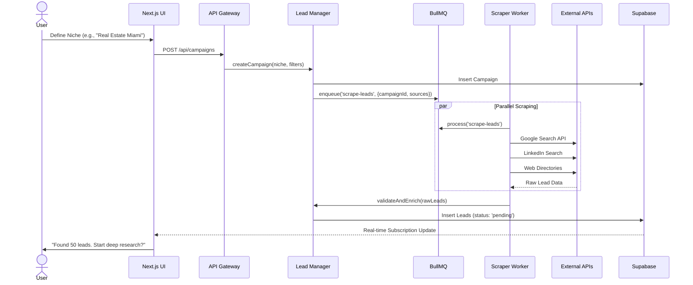
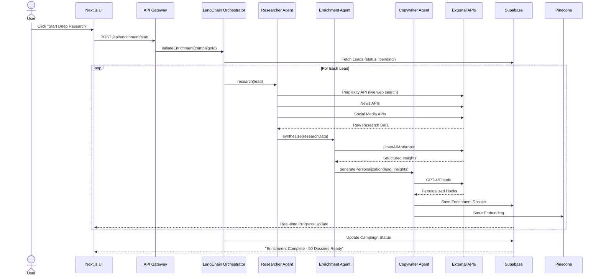
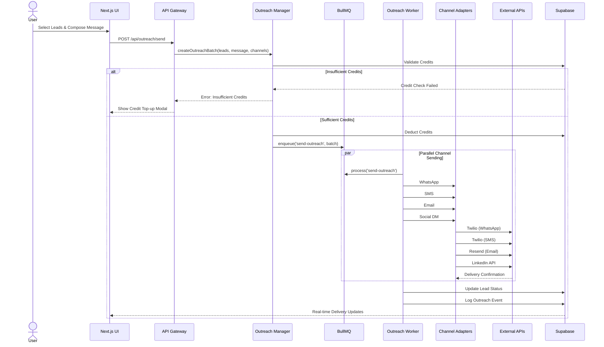
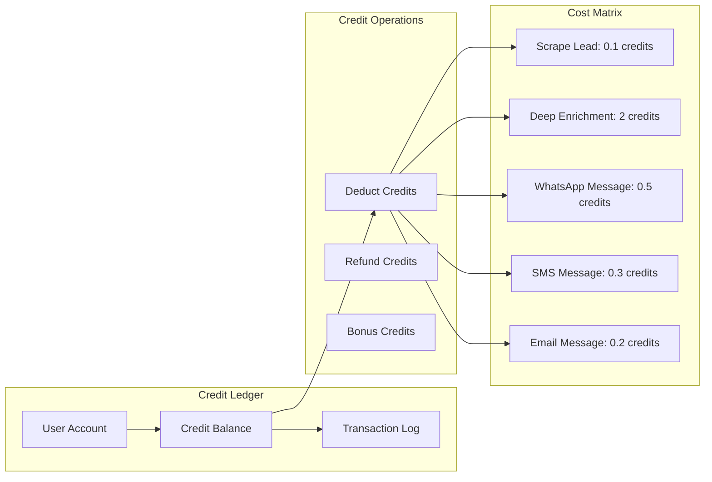
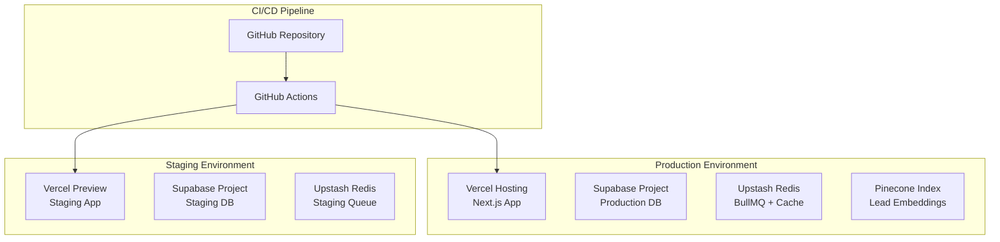

# Leadii - System Architecture

## Executive Overview

Leadii is a distributed, event-driven AI platform built on modern cloud-native principles. The architecture separates concerns into distinct layers: Presentation, API Gateway, Business Logic (AI Agents), and Data Persistence.

---

## System Architecture Diagram

```mermaid
flowchart TB
    subgraph "Client Layer"
        WEB[Next.js 15 App Router<br/>React + Tailwind + Framer Motion]
        MOBILE[Progressive Web App]
    end

    subgraph "Edge Layer"
        CF[Cloudflare/Vercel Edge]
        AUTH[Supabase Auth<br/>JWT Middleware]
        RATE[Rate Limiter<br/>Redis-based]
    end

    subgraph "API Gateway Layer"
        API[Next.js API Routes<br/>/app/api/*]
        WEBHOOK[Webhook Handlers<br/>Stripe, Twilio, WhatsApp]
    end

    subgraph "Core Services"
        direction TB
        
        subgraph "Lead Management"
            LM[Lead Manager Service]
            SCRAPER[Scraper Engine<br/>Puppeteer/Playwright]
            VALIDATOR[Data Validator]
        end
        
        subgraph "AI Engine"
            ORCH[LangChain Orchestrator]
            RESEARCH[Researcher Agent<br/>Perplexity API]
            ENRICH[Enrichment Agent<br/>OpenAI/Anthropic]
            COPY[Copywriter Agent<br/>GPT-4/Claude]
        end
        
        subgraph "Outreach Hub"
            OM[Outreach Manager]
            WA[WhatsApp Adapter<br/>Twilio/Wati]
            SMS[SMS Adapter<br/>Twilio]
            EMAIL[Email Adapter<br/>Resend]
            SOCIAL[Social DM Adapter<br/>LinkedIn API]
        end
        
        subgraph "Billing Engine"
            BM[Billing Manager]
            STRIPE[Stripe Integration]
            CREDIT[Credit Ledger]
        end
    end

    subgraph "Job Queue Layer"
        REDIS[(Redis Cluster)]
        BULL[BullMQ Workers]
        BULL_BOARD[BullMQ Dashboard]
    end

    subgraph "Data Layer"
        SUPABASE[(Supabase Postgres<br/>Row Level Security)]
        PINECONE[(Pinecone Vector DB<br/>Lead Embeddings)]
        S3[S3-compatible Storage<br/>Documents/Assets]
    end

    subgraph "External APIs"
        GOOGLE[Google Search API]
        LINKEDIN[LinkedIn API]
        PERPLEXITY[Perplexity API]
        OPENAI[OpenAI API]
        ANTHROPIC[Anthropic API]
    end

    %% Client Connections
    WEB --> CF
    MOBILE --> CF
    
    %% Edge Layer
    CF --> AUTH
    AUTH --> RATE
    RATE --> API
    
    %% API to Services
    API --> LM
    API --> ORCH
    API --> OM
    API --> BM
    API --> WEBHOOK
    
    %% Lead Management Flow
    LM --> SCRAPER
    SCRAPER --> GOOGLE
    SCRAPER --> LINKEDIN
    LM --> VALIDATOR
    VALIDATOR --> SUPABASE
    
    %% AI Engine Flow
    ORCH --> RESEARCH
    ORCH --> ENRICH
    ORCH --> COPY
    RESEARCH --> PERPLEXITY
    ENRICH --> OPENAI
    COPY --> ANTHROPIC
    
    %% Outreach Flow
    OM --> WA
    OM --> SMS
    OM --> EMAIL
    OM --> SOCIAL
    WA --> TWILIO_WA[Twilio WhatsApp]
    SMS --> TWILIO_SMS[Twilio SMS]
    EMAIL --> RESEND_API[Resend API]
    
    %% Billing Flow
    BM --> STRIPE
    BM --> CREDIT
    STRIPE --> STRIPE_API[Stripe API]
    
    %% Queue Integration
    LM --> BULL
    ORCH --> BULL
    OM --> BULL
    BM --> BULL
    BULL --> REDIS
    
    %% Data Persistence
    LM --> SUPABASE
    ORCH --> SUPABASE
    ORCH --> PINECONE
    OM --> SUPABASE
    BM --> SUPABASE
    
    %% Webhooks
    WEBHOOK --> STRIPE
    WEBHOOK --> TWILIO_WA
    WEBHOOK --> TWILIO_SMS
```



---

## Data Flow Architecture

### Phase 1: Lead Generation Flow



### Phase 2: AI Deep Enrichment Flow



### Phase 3: Multi-Channel Outreach Flow



---

## Credit System Architecture



---

## Multitenancy & Security Model

```mermaid
flowchart TB
    subgraph "Tenant Isolation"
        USER1[User A - tenant_id: org_123]
        USER2[User B - tenant_id: org_456]
        
        subgraph "org_123 Data"
            DB1[(Leads A)]
            ENR1[(Enrichments A)]
            CAMP1[(Campaigns A)]
        end
        
        subgraph "org_456 Data"
            DB2[(Leads B)]
            ENR2[(Enrichments B)]
            CAMP2[(Campaigns B)]
        end
        
        USER1 --> DB1
        USER1 --> ENR1
        USER1 --> CAMP1
        
        USER2 --> DB2
        USER2 --> ENR2
        USER2 --> CAMP2
    end

    subgraph "Row Level Security"
        RLS1[RLS Policy: tenant_id = current_user_id()]
        RLS2[RLS Policy: tenant_id = current_user_id()]
    end

    DB1 --> RLS1
    DB2 --> RLS2
```

---

## Technology Stack Details

| Layer | Technology | Purpose |
|-------|------------|---------|
| **Frontend** | Next.js 15 (App Router) | SSR, API Routes, React Server Components |
| **Styling** | Tailwind CSS + shadcn/ui | Utility-first styling, accessible components |
| **Animations** | Framer Motion | Layout transitions, micro-interactions |
| **State** | Zustand + React Query | Client state, server state caching |
| **Backend** | Node.js + TypeScript | Type-safe API development |
| **Database** | Supabase (Postgres) | Relational data, Auth, Real-time |
| **Vector DB** | Pinecone | Lead embeddings, semantic search |
| **Queue** | BullMQ + Redis | Background job processing |
| **AI Engine** | LangChain | Agent orchestration |
| **Search** | Perplexity API | Live web research |
| **LLM** | OpenAI GPT-4 / Claude 3 | Copywriting, enrichment |
| **Messaging** | Twilio (SMS/WhatsApp), Resend (Email) | Multi-channel outreach |
| **Payments** | Stripe | Subscription + credit billing |
| **Monitoring** | Sentry + LogRocket | Error tracking, session replay |

---

## Scalability Considerations

### Horizontal Scaling
- **API Layer**: Vercel Edge Functions auto-scale
- **Worker Layer**: Containerized BullMQ workers on Kubernetes
- **Database**: Supabase read replicas for query scaling
- **Queue**: Redis Cluster for high-throughput job processing

### Performance Optimizations
- **Caching**: Redis for lead data, session state
- **CDN**: Vercel Edge Network for static assets
- **Database**: Indexed queries, connection pooling
- **AI Calls**: Batched LLM requests, response caching

---

## Deployment Architecture


